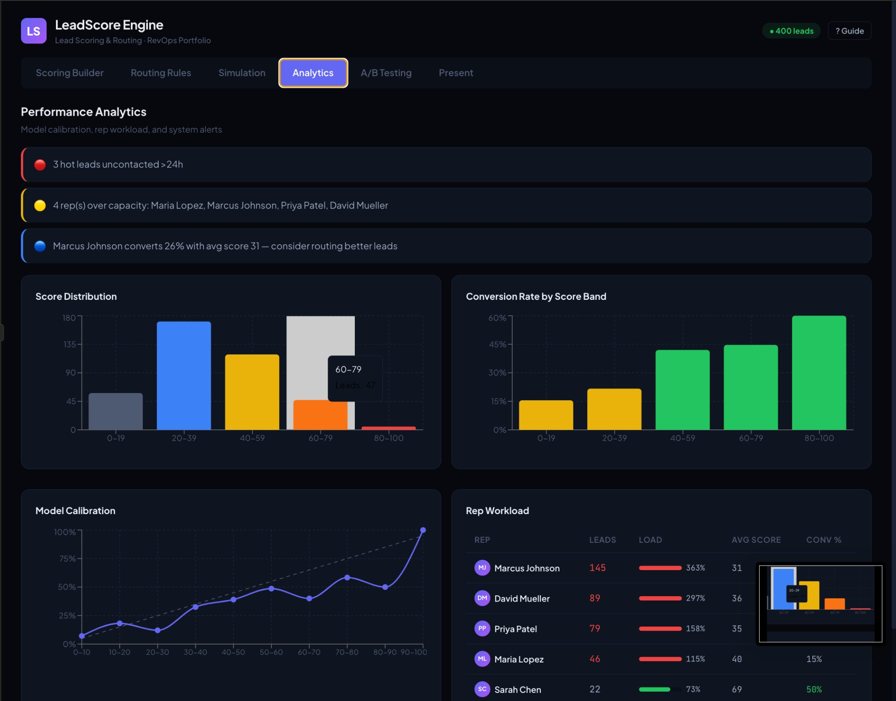
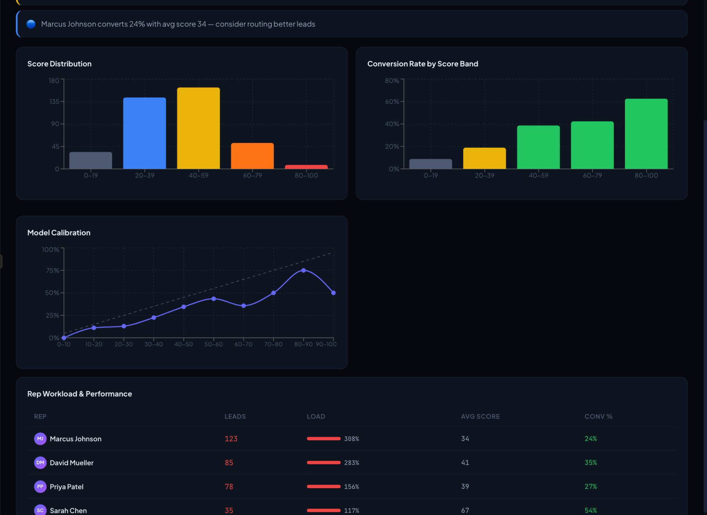
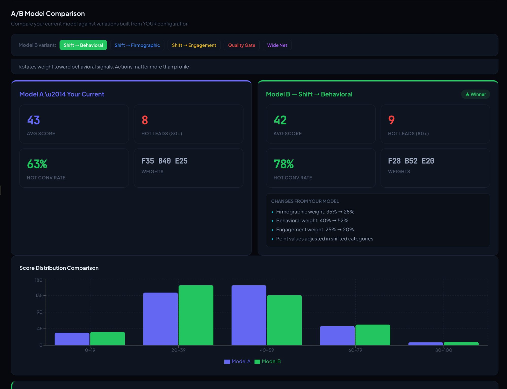

# LeadScore Engine

**Configurable lead scoring, rule-based routing, and model optimization — in the browser.**

LeadScore Engine scores incoming leads across firmographic, behavioral, and engagement signals, then routes them to the right sales rep automatically based on rules you define. Built-in analytics tell you if the model is actually working, and A/B testing lets you compare configurations before deploying changes.

[**→ Live App**](https://antmend.github.io/lead-scoring)

---



## What It Does

**Scoring.** Each lead gets a score from 0–100 based on three signal categories: Firmographic (company size, industry, title), Behavioral (demo requests, pricing page views, content downloads), and Engagement (session frequency, recency, email opens). Every criterion has configurable points and can be toggled on or off. Category weights auto-balance to 100%.

**Routing.** Rules evaluate top-to-bottom — first match wins. Route by score threshold, industry, region, or round-robin across teams. Each rule's conditions, assignment, and priority are fully editable. Add reps, remove them, adjust capacity limits.

**Analytics.** Score distribution, conversion rate by score band, model calibration (predicted vs. actual conversion by decile), and rep workload with utilization tracking. The system flags problems automatically: hot leads going uncontacted, reps over capacity, industries where the model is miscalibrated.

**A/B Testing.** Compare your current model against five transformation presets — all built relative to YOUR configuration, not arbitrary baselines. See which variant produces better hot-lead conversion before changing anything.

---



## Features

### Scoring Builder
- Three signal categories with individual criterion control
- Add, remove, reorder, and toggle criteria
- Point values from -30 to +30 per criterion
- Category weights with +/- controls, auto-balanced to 100%
- Export model as JSON

### Routing Rules Engine
- Priority-ordered rules with cascading evaluation
- Conditions: score thresholds, industry, region, company size
- Operators: ≥, ≤, = with appropriate value inputs per field
- Assignment: specific rep or round-robin across team
- Fully editable: click any rule to modify name, conditions, and target
- Add/remove reps with team and capacity settings
- Export rules as JSON

### Live Simulation
- **Live Feed**: Watch 400 leads get scored and routed one-by-one with full breakdown — score calculation, matched rule, assigned rep
- **Table View**: All leads with tier filters (Hot/Warm/Cool/Cold), sortable columns, click-to-expand detail panel
- Speed control: 1x, 3x, 10x

### Performance Analytics
- Score distribution histogram
- Conversion rate by score band — validates the model works
- Model calibration chart — predicted vs. actual conversion by decile
- Rep workload table with utilization bars and conversion rates
- Smart alerts: hot leads uncontacted >24h, reps over capacity, miscalibrated industries, underutilized high-performers

### A/B Model Testing
Five relative presets that transform your current model:

| Preset | What It Does |
|---|---|
| **Shift → Behavioral** | Rotates 20% weight toward behavioral signals, boosts action-based criteria |
| **Shift → Firmographic** | Rotates 20% weight toward firmographic signals, boosts profile-based criteria |
| **Shift → Engagement** | Rotates 20% weight toward engagement signals, boosts recency/activity criteria |
| **Quality Gate** | Keeps your weights, disables weakest criteria per category (top 3 only) |
| **Wide Net** | Keeps your weights, boosts all point values by 40% |

Side-by-side comparison: avg score, hot lead count, hot conversion rate, score distribution chart, and winner recommendation.

### Present Mode
Clean, shareable view with hero metrics, score tier breakdown, and hot lead insight. Ready for a leadership meeting.

---



## Demo Data

The app ships with 400 pre-generated leads with realistic attributes and known conversion outcomes. The dataset includes intentional patterns:

- **Overloaded rep** — One rep catches the default routing rule and accumulates 3x their capacity
- **Miscalibrated industry** — Healthcare leads score high on firmographic signals but convert poorly
- **Hidden performer** — A mid-market rep with low average score but above-average conversion rate
- **Hot leads at risk** — Three high-score leads uncontacted for 48+ hours

These patterns surface naturally through Analytics alerts without being hardcoded into the UI — the scoring and routing engines discover them.

## Tech

React + Vite, Recharts for visualization, deployed on GitHub Pages. Single-page app, no backend — all scoring, routing, and analytics computed client-side in real time.

## Run Locally
```bash
git clone https://github.com/AntMend/lead-scoring.git
cd lead-scoring
npm install
npm run dev
```

---

Built by [Antonio Mendoza](https://github.com/AntMend)
